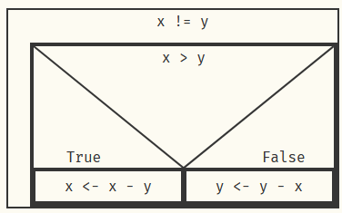

# Software Development Practice

## Session 1
10.04.2025

- Introduction
- CORE
- Knowledge Quiz
- Setup IDE
    - Visual Studio Code (https://code.visualstudio.com/Download)
    - Java Development Kit (https://www.oracle.com/java/technologies/downloads/#java21)
    - Version Control System (https://git-scm.com/downloads)
    - Starting Visual Studio Code and installing Java Extensions
    - git clone https://github.com/hshdacs/SDP_S_2025_04
    - Open Folder SDP_S_2025_04
    - Open file Test.java and run (above main)

## Session 2
17.04.2025

- Fundamentals (of Programming)
    - Bit (Binary Digit, smallest representation of data)
    - Sequence of bits
        - Byte (8 bits, smallest element of a storage device, e.g. memory)
        - Word (16 bits)
        - Doubleword (32 bits)
        - Quadword (64 bits)
    - Capacity
        - Bytes
        - Kilobyte (1'024 bytes, because 2^10)
        - Megabyte (1'048'576 bytes, because 2^20)
        - Gigabyte (1'073'741'824 bytes, because 2^30)
        - Terabyte (2^40)
        - Petabyte (2^50)
        - Exabyte (2^60)
        - Zetabye (2^70)
    - Agreements of data to obtain information (Code)
        - ASCII (7 bit code) -> ANSI
        - ISO Latin-1 (8 bit code, but codepage required)
        - Unicode (16 bits, or 32 bits)
        - UTF-8 (variable length encoding)
    - Data types
        - boolean: true/false (1 bit, in real 32 bits)
        - byte (char C/C++): 8 bits
        - short (char Java, wchar_t C/C++): 16 bits
        - Integer (int): 32 bits
        - long: 64 bits
        - float (floating point): 32 bits
            (compound data type: significand precision:23, exponent:8, sign:1)
            => **floats are evil**
        - double: 64 bits (sp:52, exponent:11, sign:1)
    - Operation
        ```
        =,
        +, -, *, /, %,
        ++, --,
        += (a += 7 ==> a = a + 7), -=, ...
        &, |, ^, !, &&, ||,
        ==, !=, <=, >=,
        <<, >>
        ```
    - Some weirds thing in programming
        limited space for numbers, e.g. byte
        byte is a signed value of 8 bits,
        highest positive value is 0b0111'1111 (127)
        lowest negative value is  0b1000'0000 (-128)
    - Algorithm
        - Elements
            - Sequence
            - Condition (if, switch)
            - Loop (for, while, do-while) aka Condition with Jump
        - Formalism
            - Pseudo Code
            - Flowchart
            - Nassi-Schneiderman Diagram (Struktogramm)
        - Example (Euclid, GCD)
            ```
            When (c,d) is not (a,b), and taken alternating (a,b) or (c,d) the smallest from the tallest, then it will eventually remain a number that measures both of the previous.
            ```

## Session 3
24.04.2025

- Algorithm (for imperative/procedural programming), e.g. Euclid
    - pencil test
        ```
        e.g. (a,b) = 24, (c,d) = 16
        1) 24 != 16
        2) 24 > 16
        3) 24 - 16 = 8
        4) 8 != 16
        5) 8 < 16
        6) 16 - 8 = 8
        7) 8 == 8
        => 8 is the GCD of 24 and 16: gcd(24,16) = 8
        ```
    - a better formalism
        - Pseudo (in theory there is no rule for pseudo code, but
            use the same words for the single steps of the algorithm)
            ```
            (a, b) => x
            (c, d) => y
            while x != y
                if x > y
                    x <- x - y
                otherwise
                    y <- y - x
            x (or y) => gcd
            ```
        - Flowchart
            ``` mermaid
                flowchart TD
                    Start --> id1
                    id1{x != y ?} -- no --> Stop
                    id1 -- yes --> id2{x > y ?}
                    id2 -- yes --> A[x <- x - y]
                    id2 -- no --> B[y <- y - x]
                    A --> id1
                    B --> id1
            ```
        - Nassi-Schneiderman Diagram (Struktogramm)

            

- Characteristics of Algorithms
    - Determinism
    - Determination
    - Termination
    - Effectiveness
    - Complexity (Time & Space)
        - Landau Notation
            - O(1) - constant
            - O(log2 n) - logarithmic
            - O(n) - linear
            - O(n * log2 n) - linearithmic
            - O(n^2) - square
            - O(n^k) - polynomial
            - O(k^n) - exponential
        - Special groups of algorithms
            - NP (non-destermistic polynomial) complete

- Exercise 3
    - Collatz (Number/Sequence)
    ```
        there is some integer number n (> 0)

        while (n != 1)
            if (n is even)
                n <- n / 2
            otherwise
                n <- 3*n + 1
    ```
    The big question here: will this algorithm terminate for
    every value of n?

    Extra task for the experts:
    Find the largest sequence of Collatz between 1 and 1'000'000
    ```
    e.g.
        n = 7           0
        n = 22          1
        n = 11          2
        n = 34          3
        n = 17          4
        n = 52          5
        n = 26          6
        n = 13          7
        n = 40          8
        n = 20          9
        n = 10          10
        n = 5           11
        n = 16          12
        n = 8           13
        n = 4           14
        n = 2           15
        n = 1  finished 16 length of this sequence
    ```

- Exercise 4
    Number guessing game

    Write a guessing game, where the computer randomly choose a
    secret number and the user can guess this number

    1. let the user know if the number is lower or higher
    2. MasterMind (prerequisit: no double digits, fixed number of digits)
        - give a star (*) for each digit of the guess that matches
          the digit of the secret number
        - give a circle (o) for each digit of the guess that is
          present in the secret number but on another position
        
        see https://en.wikipedia.org/wiki/Mastermind_(board_game)

        Hint: using methods (functions/procedures/subroutines)
    ```
    e.g. secret number 4713
         guess is      2739
         hint will be  *o--
    ```

